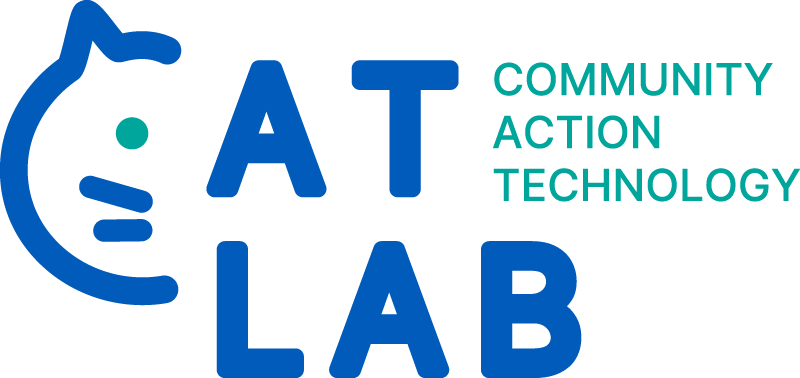

---
# Feel free to add content and custom Front Matter to this file.
# To modify the layout, see https://jekyllrb.com/docs/themes/#overriding-theme-defaults

layout: home
---

## The Community Action Technology (CAT) Lab at the University at Buffalo does interdisciplinary, community-engaged research on how AI systems can be designed and governed to center **care** and **collectivity**.

We use a combination of qualitative interviews and field work, collaborative and participatory design, and field deployments of novel data-driven and algorithmic systems in order to amplify the voices of marginalized communities and how they experience and reimagine sociotechnical systems. Currently, our work is focused largely on home care work in Western New York, New York State, and the United States. Some topics that we are interested in include:

* Labor justice, futures of work, worker cooperatives
* Health equity, disability justice, communities of care
* Community-driven AI, critical AI literacy, AI for social good
